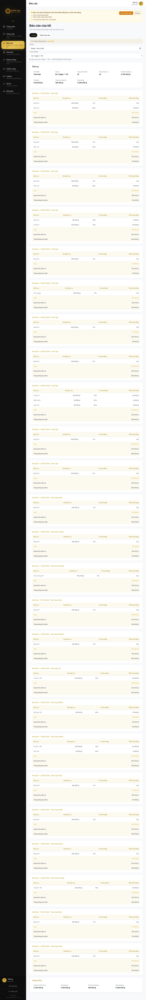
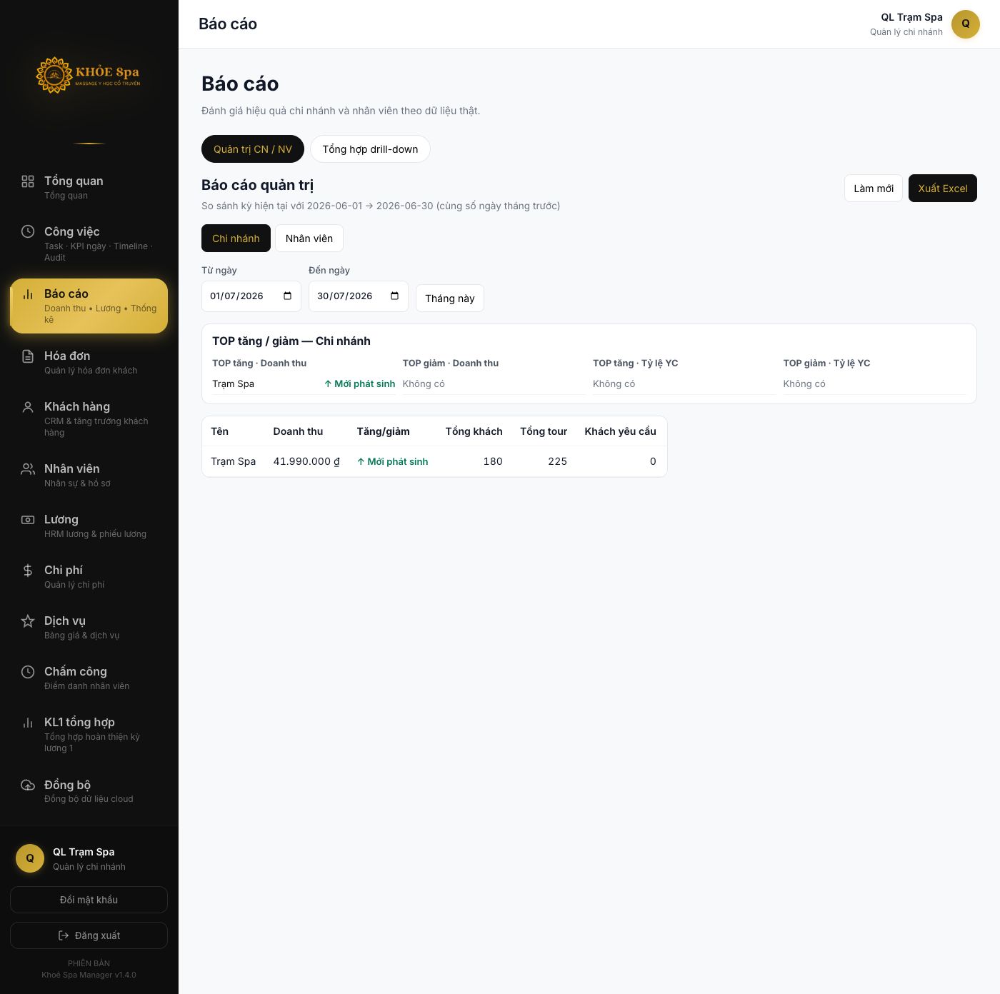
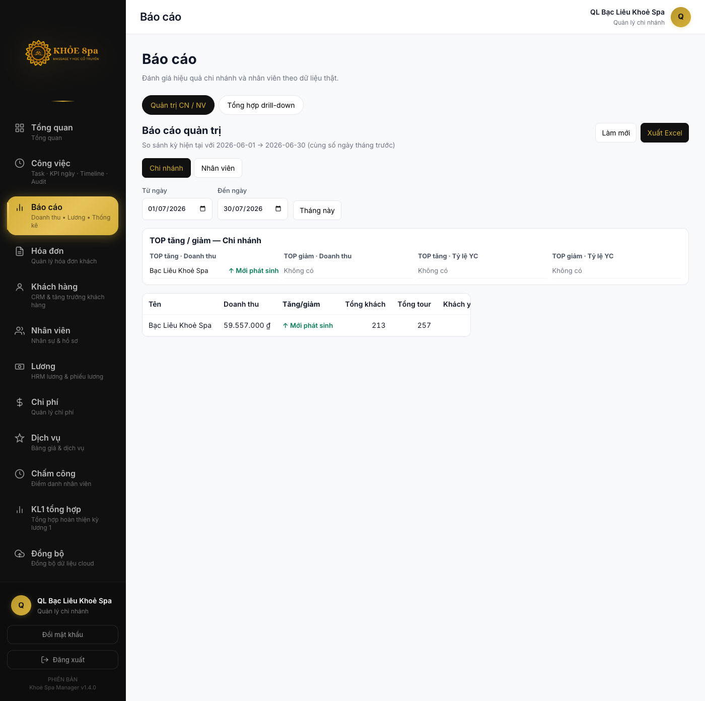
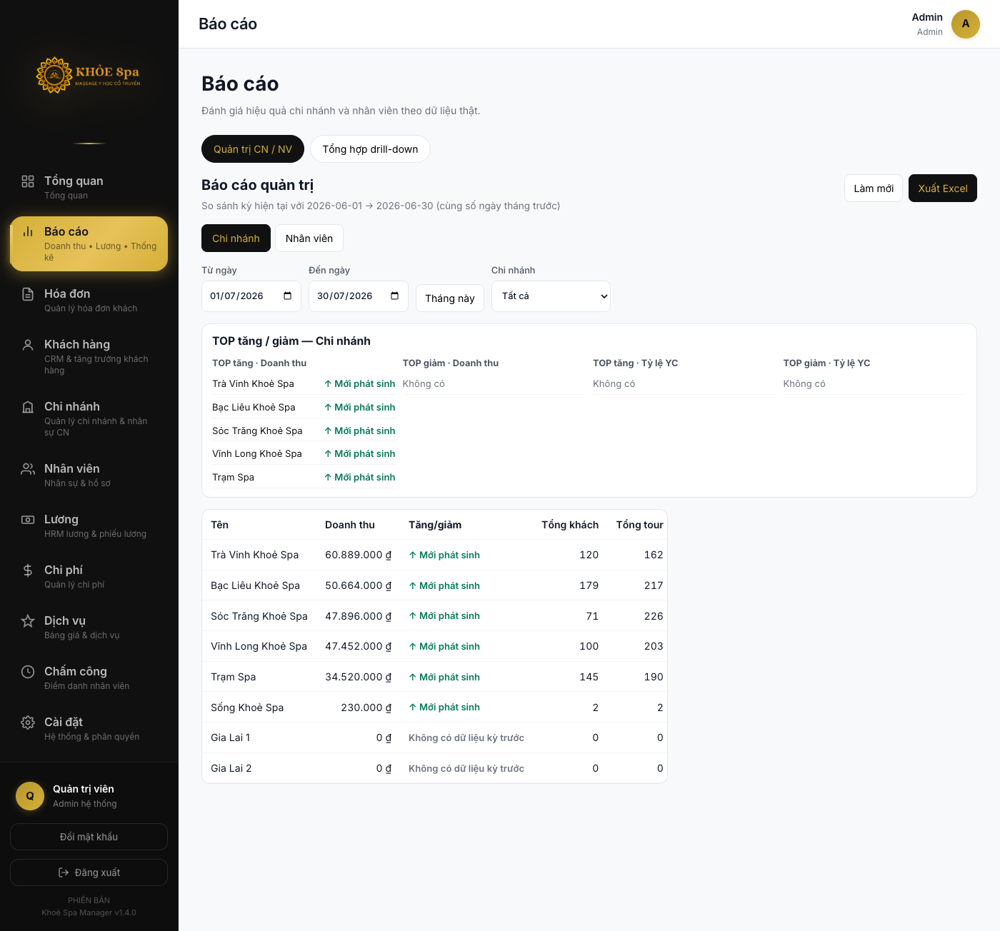

# UAT Evidence Report — Employee Lifecycle V1

Generated: 2026-07-30T10:27:41.494Z
Production: https://www.khoespa.net.vn
Preview: http://127.0.0.1:4173

## Cherry (`tram-spa-cherry`)

| Field | Value |
|-------|-------|
| Current branch (DB) | `tram-spa` |
| Expected after transfer test | `bac-lieu` |
| Status | active |
| Branch history entries | 2 |

**Branch history (Production):**
- 2026-07-30: tram-spa → bac-lieu
- 2026-07-30: bac-lieu → tram-spa

### Số liệu Production

| Metric | Total | By branch |
|--------|------:|-----------|
| **Invoice** | 35 | {"tram-spa":35} |
| Invoice T7/2026 | 35 | |
| **Attendance** | 21 | {"tram-spa":21} |
| Attendance T7/2026 | 21 | |
| **Payroll adjustments** | 0 | {} |
| **Customer Requested** | 0 invoices | |
| **Activity Log** | 0 | audit=0, profile=0 |

### Payroll T7/2026 (computed from Production data)

- Net salary: **4.760.000 ₫**
- Ticket revenue: **5.440.000 ₫**

## Trúc Ly (`tram-spa-truc-ly`)

| Field | Value |
|-------|-------|
| Current branch (DB) | `tram-spa` |
| Expected after transfer test | `soc-trang` |
| Status | active |
| Branch history entries | 4 |

**Branch history (Production):**
- 2026-07-30: tram-spa → soc-trang
- 2026-07-30: soc-trang → tram-spa
- 2026-07-30: tram-spa → soc-trang
- 2026-07-30: soc-trang → tram-spa

### Số liệu Production

| Metric | Total | By branch |
|--------|------:|-----------|
| **Invoice** | 25 | {"tram-spa":25} |
| Invoice T7/2026 | 25 | |
| **Attendance** | 19 | {"tram-spa":18,"soc-trang":1} |
| Attendance T7/2026 | 19 | |
| **Payroll adjustments** | 1 | {"tram-spa":1} |
| **Customer Requested** | 0 invoices | |
| **Activity Log** | 0 | audit=0, profile=0 |

### Payroll T7/2026 (computed from Production data)

- Net salary: **2.290.000 ₫**
- Ticket revenue: **4.750.000 ₫**

## Cherry — Phạm vi nhìn theo vai trò (giả lập session @ bac-lieu, data Production)

> **Lưu ý DB:** Cherry hiện tại đang ở `tram-spa` (đã chuyển ngược từ bac-lieu). Bảng dưới mô phỏng **sau khi chuyển sang bac-lieu** với Record Branch giữ nguyên.

| Role | Invoices | tram-spa inv | Attendance | tram-spa att | Adjustments |
|------|--------:|-------------:|-----------:|-------------:|------------:|
| Cherry Employee (@ bac-lieu) | 35 | 35 | 21 | 21 | 0 |
| QL Trạm Spa (tram-spa) | 35 | 35 | 21 | 21 | 0 |
| QL chi nhánh mới (bac-lieu) | 0 | 0 | 0 | 0 | 0 |
| Admin | 35 | 35 | 21 | 21 | 0 |

## Trúc Ly — Phạm vi nhìn theo vai trò (giả lập session @ soc-trang, data Production)

> **Lưu ý DB:** Trúc Ly hiện tại đang ở `tram-spa`. Bảng mô phỏng session @ soc-trang.

| Role | Invoices | tram-spa inv | Attendance | tram-spa att | Adjustments |
|------|--------:|-------------:|-----------:|-------------:|------------:|
| Trúc Ly Employee (@ soc-trang) | 25 | 25 | 19 | 18 | 1 |
| QL Trạm Spa (tram-spa) | 25 | 25 | 18 | 18 | 1 |
| QL chi nhánh mới (soc-trang) | 0 | 0 | 1 | 0 | 0 |
| Admin | 25 | 25 | 19 | 18 | 1 |

## Lifecycle Demo (Production — `uat-lifecycle-v1-demo`)

| Step | OK | Detail |
|------|:--:|--------|
| 1. Tạo nhân viên mới | ✓ | uat-lifecycle-v1-demo |
| 2. Username + Password + Đăng nhập | ✓ | uat-lifecycle-v1-demo |
| 3. Đổi tên + Đăng nhập lại | ✓ |  |
| 4. Chuyển chi nhánh + Đăng nhập lại | ✓ |  |
| 5. Nghỉ việc → không đăng nhập | ✓ | Sai tên đăng nhập hoặc mật khẩu |
| 6. Kích hoạt lại + Đăng nhập | ✓ |  |

- Username: `uat-lifecycle-v1-demo`
- Password (default): `uatdemov1tramspa`
- All steps OK: **YES**

## Screenshots (Preview + Production Supabase)

| File | Mô tả |
|------|--------|
| `manager-tram-spa-report.png` | QL Trạm Spa — Báo cáo CN: 41.990.000đ, 225 tour T7/2026 |
| `manager-bac-lieu-report.png` | QL Bạc Liêu — Báo cáo CN: 59.557.000đ, 257 tour T7/2026 |
| `truc-ly-employee-salary.png` | NV Trúc Ly — Lương đa chi nhánh: Trạm Spa 25 HĐ + Sóc Trăng 1 HĐ |
| `admin-payroll.png` | Admin — Bảng lương tất cả 8 chi nhánh T7/2026 |
| `manager-tram-spa-after-login.png` | QL Trạm Spa sau login |
| `manager-bac-lieu-after-login.png` | QL Bạc Liêu sau login |
| `admin-after-login.png` | Admin sau login |

> Cherry employee screenshot: cần `CHERRY_PASSWORD` (customPassword=true). Login NV: `tram-spa-truc-ly` / `truclytramspa` ✓

